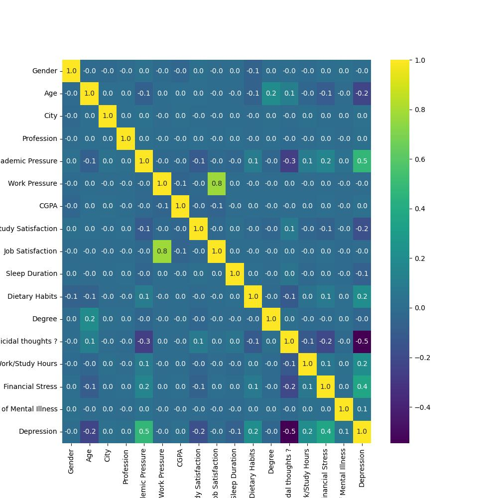

# Student Depression Prediction Model 🧠💤

This repository contains a machine learning project designed to predict the likelihood of depression in students. By analyzing key lifestyle factors from the provided dataset, such as **sleep duration** and **total self-reported stress**, the model aims to identify at-risk individuals. This serves as a potential tool for early intervention and highlights the importance of student wellness.

The entire analysis, from data exploration to model training and evaluation, is documented within the project's Jupyter Notebooks.

## 📂 Repository Structure

This project is organized into the following key files:

```
.
├── 📄 DepressionData.csv    # The raw dataset used for training and analysis
├── Mental-Health.ipynb # The main Jupyter Notebook with the full analysis
├── README.md               # You are here!
└── Explain.ipynb              # A notebook for the documentation of the project
```

* **`Mental-Health.ipynb`**: This is the primary notebook. It contains all steps of the project, including data cleaning, exploratory data analysis (EDA), model training, and performance evaluation. **Start here to see the full workflow.**
* **`Explain.ipynb`**: This notebook is used to give a documentation of the project.
* **`DepressionData.csv`**: The dataset containing anonymized student survey data on mental health and lifestyle factors.

## 📊 Project Visualization

Here is a snapshot from the `MENTAL HEALTH.ipynb` notebook, illustrating the correlation between the features of the dataset.



## ✨ Key Features

* **Data Cleaning & Preprocessing:** Handled missing values and prepared categorical data for modeling.
* **Exploratory Data Analysis (EDA):** Generated visualizations to uncover trends and relationships between variables.
* **Model Training:** Implemented and trained a classification model (e.g., Logistic Regression, Random Forest, etc.) to predict depression levels.
* **Performance Evaluation:** Assessed the model's accuracy, precision, and recall to determine its effectiveness.

## 🛠️ Tech Stack & Libraries

This project was developed entirely in Python and leverages the following core data science libraries:

* **Python 3.x**
* **Jupyter Notebook:** For interactive development and analysis.
* **Pandas:** For data manipulation and analysis.
* **NumPy:** For numerical operations.
* **Matplotlib & Seaborn:** For data visualization.
* **Scikit-learn:** For building and evaluating the machine learning model.

## 🚀 How to Run This Project

To explore the code and run the analysis on your own machine, please follow these steps:

**1. Clone the Repository**

```bash
git clone https://github.com/amineelgardoum-rgb/Depression_Predict.git
cd Depression_Predict
```

**2. Install Dependencies**
It's highly recommended to use a virtual environment to manage dependencies. The required libraries can be found in a `requirements.txt` file. If you don't have one, you can install them manually.

```bash
# Recommended: Create and activate a virtual environment
python -m venv venv
source venv/bin/activate  # On Windows, use `venv\Scripts\activate`

# Install the required libraries
pip install pandas numpy matplotlib seaborn scikit-learn jupyter
```

**3. Launch Jupyter Notebook**
Once the dependencies are installed, you can start the Jupyter environment:

```bash
jupyter notebook
```

This will open a new tab in your browser. From there, you can navigate to and open `Mental -Health.ipynb` or `Explain.ipynb` to view and run the code. The `DepressionData.csv` file will be loaded directly by the notebooks.

## 📈 Model Performance

The final classification model, as detailed in `Mental=Health.ipynb`, achieved the following performance on the test set:

| Metric              | Score              |
| :------------------ | :----------------- |
| **Accuracy**  | 0.8043010752688172 |
| **Precision** | 0.80               |
| **Recall**    | 0.80               |
| **F1-Score**  | 0.80               |
